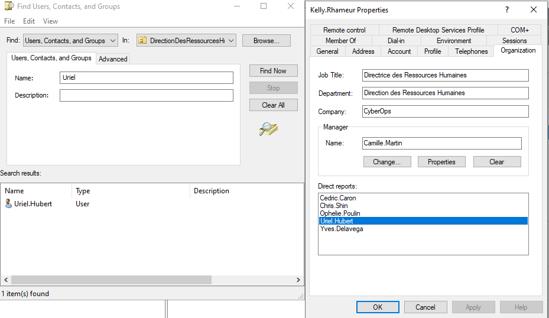
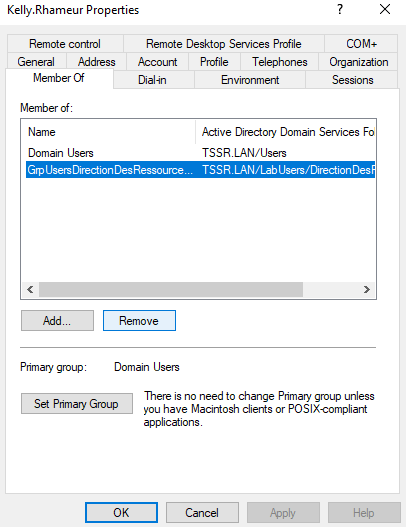
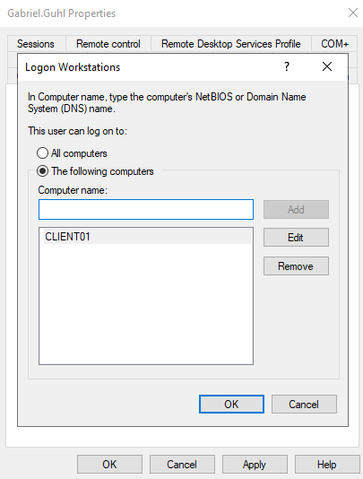

### Partie 1 : Gestion des utilisateurs
--------

#### Q.1.1.1 Créer l'utilisateur Lionel Lemarchand avec les même attribut de société que Kelly Rhameur.
> Création de l'utilisateur **Lionnel Lemarchand** :

> 

> Attribution de l'adresse mail :

> 

> Attribution du manager de l'ancien utilisateur remplacé:

> 

> Gestion d'autre utilisateur par celui-ci :

> 

> Moyen de trouver les différents utilisateurs dont **Kelly Rhameur** :

> 

#### Q.1.1.2 Créer une OU DeactivatedUsers et déplace le compte désactivé de Kelly Rhameur dedans.
> Création de l'OU DesactivedUsers :

> 

> 

> Déplacement de **Kelly Rhameur** dans l'OU desactivatedUsers => ``Clic droit sur **Kelly Rhameur** => Move => DesactivatedUsers``
> 

#### Q.1.1.3 Modifier le groupe de l'OU dans laquelle était Kelly Rhameur en conséquence.

> Clic droit sur **Kelly Rhameur** => ``Properties => Member Of => GrpUsersDirectionDesRessources/Checkpoint3_Exercice1/Humaines => Remove``
> 

#### Q.1.1.4 Créer le dossier Individuel du nouvel utilisateur et archive celui de Kelly Rhameur en le suffixant par -ARCHIVE.
> Création du dossier Individuel :
> Dans Lecteur F: ``DossierIndividuels => Clic Droit New => Folder => Lionnel.Lemarchand``

> Archivage => ``Clic droit ou F2 sur le fichier de **Kelly.Rhameur** ajouter le suffixe **-ARCHIVE**``
> 

--------

### Partie 2 : Restriction utilisateurs
-------- 

#### Q.1.2.1 Faire en sorte que l'utilisateur Gabriel Ghul ne puisse se connecter que du lundi au vendredi, de 7h à 17h.
> Utilisation de l'action **FIND** , ``clic droit sur **Gabriel Ghul** => Properties => Account => LogonHours => Séléction des heures 7h-17h du lundi au vendredi`` :

> 
> 

#### Q.1.2.2 De même, bloquer sa connexion au seul ordinateur CLIENT01.
> Cette fois allez dans l'option ``**log On TO** , cochez The Following Computers => renseigner CLIENT01 => ADD``

> 

#### Q.1.2.3 Mettre en place une stratégie de mot de passe pour durcir les comptes des utilisateurs de l'OU LabUsers.
> Lancer le centre administratif d'Active Directory => TSSR => System => Password Settings Container => New => Appliquer la politique de durcissement selon votre configuration puis choisir la cible dans l'onlet **Directly Applies to**

> 

> Pour choisir les comptes utilisateur de l'OU LabUsers =>``ADD => Advanced => Object Types = Users => Locations = LabUsers => Find Now => Séléctionner tout les utilisateurs puis OK``

> 
> 
> 

---------

### Partie 3 : Lecteurs réseaux

---------

#### Q.1.3.1 Créer une GPO Drive-Mount qui monte les lecteurs E: et F: sur les clients.
